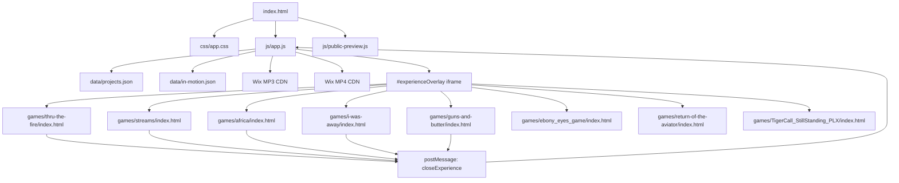

# Project Map — 2flyKeithLogan.com

## Executive Architecture Summary

`2flyKeithLogan.com` is a high-aesthetic, media-rich static single-page application (SPA) paired with an independent library of browser-native **Playable Experiences** under `/games`.

- **Primary Entry Point**: [`index.html`](file:///c:/Users/2flyk/Documents/GitHub/2flyKeithLogan/index.html)
- **Frontend Framework**: Vanilla HTML5, Vanilla CSS3 (`css/app.css`), Vanilla ES6+ JavaScript (`js/app.js`, `js/public-preview.js`).
- **Build System**: None (no npm build step, Webpack, Vite, or bundler required).
- **Data Architecture**: Dynamic JSON schemas located in `data/` (`projects.json`, `in-motion.json`).
- **Media Hosting**: Heavy audio (MP3) and video (MP4) files are served via Wix CDN (`static.wixstatic.com`, `video.wixstatic.com`) to ensure high bitrate delivery without repository bloat.
- **Hosting Platform**: GitHub Pages (`https://2flykl.github.io/2flyKeithLogan/`).
- **Deployment Safety**: `.nojekyll` flags in root, `/games`, and `/pages` bypass Jekyll build steps and preserve folder structures.

---

## Repository & Git Status

- **Git Branch**: `main`
- **Tracked Code Base**: Website root files, `/js`, `/css`, `/data`, `/assets`, and 6 game subdirectories.
- **Untracked Local Directories**:
  - `games/ebony_eyes_game/` (Complete Lock & Flow puzzle game, missing from remote)
  - `games/TigerCall_StillStanding_PLX/` (Complete Rayen tribute rhythm game, missing from remote)
  - `.agents/` & `AGENTS.md` (Agent system operating contract)
  - `docs/` (Project documentation)
  - `game-specs/` (Game specification documents)
  - `scripts/` & `setup/` (Setup utility files)
- **Missing Remote Assets**:
  - `games/i-was-away/audio/i-was-away.mp3` (4.4 MB local audio file not committed to `origin/main`, leading to a production 404 error).

---

## Route & Page Inventory

The core website operates as a hash-routed SPA. All views are rendered in `#main` via `js/app.js`:

| Route / Hash | Purpose & Component | Interactive Elements |
| :--- | :--- | :--- |
| `#home` | Hero showcase & project entry | Hero canvas FX, Cover rail carousel, 3-point CTA (Listen, Watch, Play), Direct hub buttons |
| `#firsttime` | Visitor orientation view | Guided breakdown of the Anti-Algorithm platform philosophy |
| `#music` | Music Showcase | Tracklist player, cover art stage, MP3 download modal trigger, crossfade preview |
| `#videos` | Video Showcase | Visual chapter selector, full-screen video overlay modal (`#cinemaOverlay`) |
| `#experiences` | Playable Experiences Catalog | Objective summary, mechanics list, direct iframe launch overlay (`#experienceOverlay`) |
| `#flyzone` | External Studio Link | Opens `https://twofly-final-beta.onrender.com/studio/` in new tab |
| `#motion` | What's In Motion Roadmap | Project progress tracker, update feed from `data/in-motion.json` |
| `#support` | Help 2Fly Create Modal | "Pay What It's Worth" custom amount modal (`#supportOverlay`) prefilled by project |
| `#project/:id` | Dedicated Project Portal | Deep dive for individual universes (`#project/fire`, `#project/streams`, `#project/africa`, `#project/away`) |

---

## Subsystem & Directory Purpose Map

To prevent accidental deletion or relocation of nested folders, their verified purpose is documented below:

1. **`/games/` (Primary Game Subsystem)**:
   - Contains live playable experiences, shared styles (`games/shared/base.css`), and game assets.
2. **`/games/games/` (Relative Path Fallback Subsystem)**:
   - Contains fallback copies of `africa`, `guns-and-butter`, `streams`, `thru-the-fire`, and `game.css`.
   - **Purpose**: Prevents broken links when sub-pages or external embeds attempt relative path resolution matching `games/games/...`.
3. **`/pages/` (Static Page Archive)**:
   - Contains static standalone pages (`index.html`, `experiences.html`, `help-me-create.html`, `music.html`, `videos.html`, `navigation-test.html`) and nested `pages/games/`.
   - **Purpose**: Historical staging backups and direct static entry testing.
4. **`/assets/`**:
   - Holds shared project cover art (`assets/covers/`) and platform branding icons.
5. **`/css/` & `/js/`**:
   - `css/app.css`: Core design system, variables, dark mode styling, and responsive layout tokens.
   - `js/app.js`: SPA router, state manager, audio player, modal controller, and dynamic renderer.
   - `js/public-preview.js`: Floating feedback triggers, toast notifications, and preview overlay logic.

---

## Shared Dependencies

