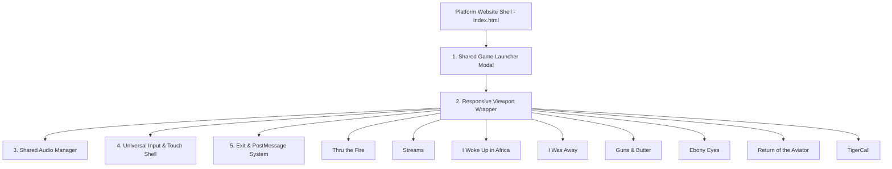

# Shared Game Systems Plan — 2flyKeithLogan.com

This document identifies reusable architecture opportunities across the **8 playable experiences** in `/games`.

> [!IMPORTANT]
> **No broad shared-runtime code changes will be implemented immediately.**
> All opportunities are documented here first to enable incremental adoption during game-by-game refinement.

---

## Shared Architecture Opportunities

---

## Opportunities Catalog

### 1. Universal Exit & Overlay Signaling (`postMessage`)
- **Current State**: Games use inconsistent exit routines:
  - `Thru the Fire`, `Streams`, `Africa`, `Guns & Butter` send `window.parent.postMessage('closeExperience', '*')`.
  - `Ebony Eyes`, `TigerCall`, `I Was Away` use internal back/reset buttons.
- **Shared System Design**: A lightweight shared utility snippet (`games/shared/experience-sdk.js`) providing standardized exit, pause, and project-return methods.
- **Target Games**: All 8 games.

### 2. Responsive Viewport Wrapper & Safe-Area Inset Handling
- **Current State**: Games declare independent CSS resets, body overflow settings, and mobile touch pads.
- **Shared System Design**: Standardize viewport metadata, safe-area bottom padding (`env(safe-area-inset-bottom)`), and screen orientation locking across games via [`games/shared/base.css`](file:///c:/Users/2flyk/Documents/GitHub/2flyKeithLogan/games/shared/base.css).
- **Target Games**: `Return of the Aviator`, `Streams`, `I Was Away`, `TigerCall`.

### 3. Unified Touch & Virtual D-Pad Controller Patterns
- **Current State**: Each game invents custom touch button styles (e.g. `Streams` joystick vs `I Was Away` touch cluster vs `Ebony Eyes` D-pad vs `TigerCall` 4-lane buttons).
- **Shared System Design**: Create a modular CSS/JS touch control layout library in `games/shared/touch-controls.css` featuring consistent 44px+ touch targets, visual tap-active states, and haptic-style CSS animations.
- **Target Games**: `Return of the Aviator`, `Streams`, `I Was Away`, `TigerCall`, `Ebony Eyes`.

### 4. Audio Manager & Web Audio Autoplay Recovery
- **Current State**: Browser autoplay restrictions can silently block audio start in `I Was Away`, `Ebony Eyes`, and `Streams`.
- **Shared System Design**: A shared audio helper that listens for the first user touch/click interaction to resume `AudioContext` and trigger HTML5 audio playback cleanly.
- **Target Games**: `I Was Away`, `Ebony Eyes`, `Streams`, `TigerCall`, `Guns & Butter`.

### 5. Asset Preloading & Error Fallback System
- **Current State**: Heavy assets (27.7MB video in `TigerCall`, 4.4MB audio in `I Was Away`) load without progress indicators, leading to perceived lag.
- **Shared System Design**: Standardized asset loading bar pattern displaying percentage progress and graceful fallback message if an asset fails to resolve.
- **Target Games**: `TigerCall`, `I Was Away`, `Thru the Fire`, `Return of the Aviator`.

---

## Implementation Safety Strategy

1. **Incremental Adoption**: Shared systems will be placed in `games/shared/` and adopted **one game at a time** during individual game refinements.
2. **Zero Breaking Changes**: Existing standalone game launchers will continue to function independently without requiring centralized bundlers.
3. **QA Regression Gate**: Any game adopting a shared system module must undergo full browser QA verification before merging.
